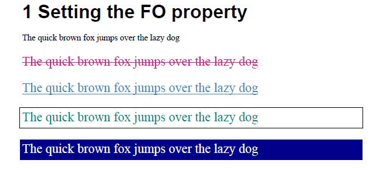
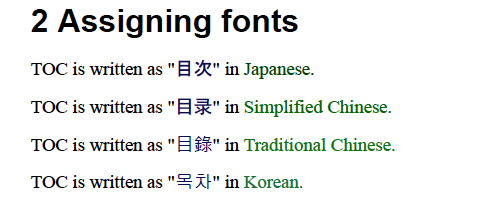
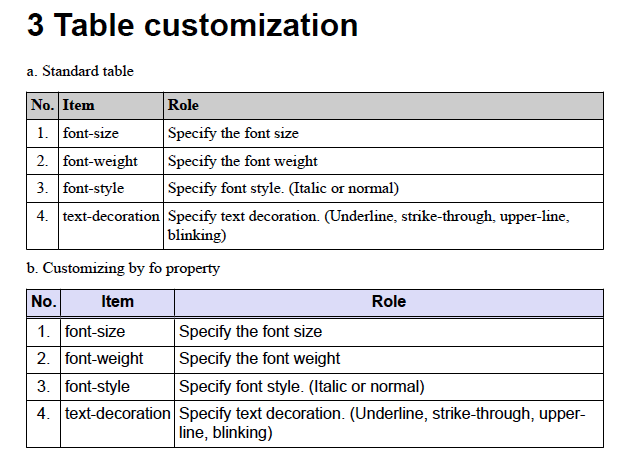
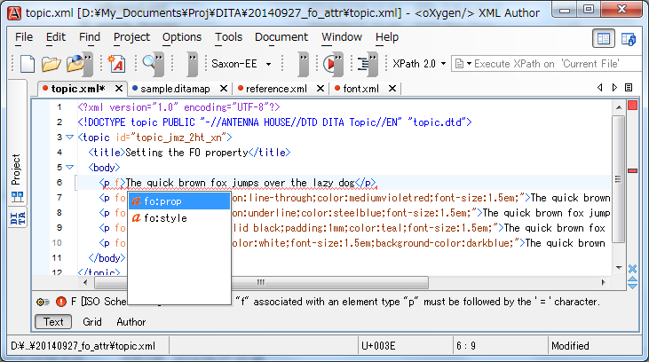
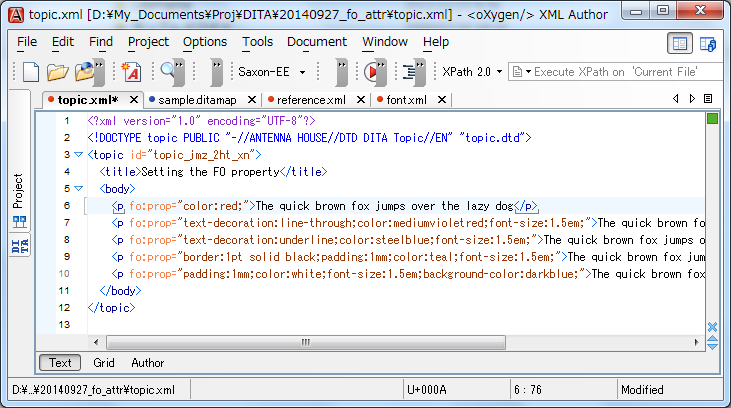

# ah-dita #
ah-dita is the DITA 1.2 specialization that enables authoring the style information by "fo:prop" property for PDF output.
It is composed of set of DTD files and it can be used as plug-in for [DITA Open Toolkit] [3].
This specialization works with [PDF5] [7] plug-in V2.1.4 or later.

## com.antennahouse.dita12.dtd folder ##

This folder contains plug-in files for DTD. To install this plug-in into DITA-OT, copy this folder to [DITA-OT]/plugins folder and run "ant -f integrator.xml".

## com.antennahouse.dita12.xsd folder ##

This folder contains plug-in files for XML Schema. The installation process is the same as plug-in for DTD.

## Examples ##

Here are some examples authored by this specialization:



```xml
<p>The quick brown fox jumps over the lazy dog</p>
<p fo:prop="text-decoration:line-through;color:mediumvioletred;font-size:1.5em;">The quick brown fox jumps over the lazy dog</p>
<p fo:prop="text-decoration:underline;color:steelblue;font-size:1.5em;">The quick brown fox jumps over the lazy dog</p>
<p fo:prop="border:1pt solid black;padding:1mm;color:teal;font-size:1.5em;">The quick brown fox jumps over the lazy dog</p>
<p fo:prop="padding:1mm;color:white;font-size:1.5em;background-color:darkblue;">The quick brown fox jumps over the lazy dog</p>
```



```xml
<p>TOC is written as "<ph fo:prop="font-family:MS Gothic;color:midnightblue;">目次</ph>" in <ph fo:prop="color:darkgreen;">Japanese.</ph></p>
<p>TOC is written as "<ph fo:prop="font-family:SimHei;color:midnightblue;">目录</ph>" in <ph fo:prop="color:green;">Simplified Chinese.</ph></p>
<p>TOC is written as "<ph fo:prop="font-family:Microsoft JhengHei;color:midnightblue;">目錄</ph>" in <ph fo:prop="color:forestgreen;">Traditional Chinese.</ph></p>
<p>TOC is written as "<ph fo:prop="font-family:Gulim;color:midnightblue;">목차</ph>" in <ph fo:prop="color:seagreen;">Korean.</ph></p>
```



```xml
<table fo:prop="font-size:12pt;font-family:Arial;">
  <tgroup cols="3">
    <colspec colnum="1" align="center"/>
    <thead fo:prop="text-align:center;background-color:lavender;">
      <row>
        <entry fo:prop="border-bottom-width:2pt;border-bottom-style:double;">No.</entry>
        <entry fo:prop="border-bottom-width:2pt;border-bottom-style:double;">Item</entry>
        <entry fo:prop="border-bottom-width:2pt;border-bottom-style:double;">Role</entry>
      </row>
    </thead>
```

## How to use ##

### Setup your XML editor ###

Setup your XML editor to use this specialization DTD.

### Change public identifier ###

Use following public identifier for your document type declaration.

```xml
<!DOCTYPE bookmap PUBLIC "-//ANTENNA HOUSE//DTD DITA BookMap//EN" "bookmap.dtd">
<!DOCTYPE map PUBLIC "-//ANTENNA HOUSE//DTD DITA Map//EN" "map.dtd">
<!DOCTYPE topic PUBLIC "-//ANTENNA HOUSE//DTD DITA Topic//EN" "topic.dtd">
<!DOCTYPE task PUBLIC "-//ANTENNA HOUSE//DTD DITA Task//EN" "task.dtd">
<!DOCTYPE concept PUBLIC "-//ANTENNA HOUSE//DTD DITA Concept//EN" "concept.dtd">
<!DOCTYPE reference PUBLIC "-//ANTENNA HOUSE//DTD DITA Reference//EN" "reference.dtd">
<!DOCTYPE task PUBLIC "-//ANTENNA HOUSE//DTD DITA General Task//EN" "generalTask.dtd">
<!DOCTYPE glossentry PUBLIC "-//ANTENNA HOUSE//DTD DITA 1.2 Glossary Entry//EN" "glossentry.dtd">
```

### Add fo attribute ###

Add fo:prop attribute using XSL-FO properties in CSS notation.

```xml
<p fo:prop="color:red;">The quick brown fox jumps over the lazy dog</p>
```





The namespace prefix "fo" is declared in the DTD as follows:

```xml
xmlns:fo="http://www.w3.org/1999/XSL/Format"
```

You can publish it using [PDF5] [7] plug-in.


## Copyright ##

Copyright (C) 2009-2015 Antenna House, Inc. All rights reserved.  
Antenna House is a trademark of [Antenna House, Inc.] [2]

## License ##

This software is licenced under the [Apache License, Version 2.0] [1].

[1]: http://www.apache.org/licenses/LICENSE-2.0 "Apache License, Version 2.0"
[2]: http://www.antennahouse.com/ "Antenna House, Inc."
[3]: http://sourceforge.net/projects/dita-ot/ "DITA Open Toolkit"
[4]: http://antennahouse.com/product.htm "Antenna House Formatter"
[5]: https://www.oasis-open.org/committees/tc_home.php?wg_abbrev=dita "OASIS Darwin Information Typing Architecture (DITA)"
[6]: http://www.w3.org/TR/xsl/ "XSL Formatting Object"
[7]: https://github.com/AntennaHouse/pdf5 "DITA Open Toolkit PDF5 plug-in"
